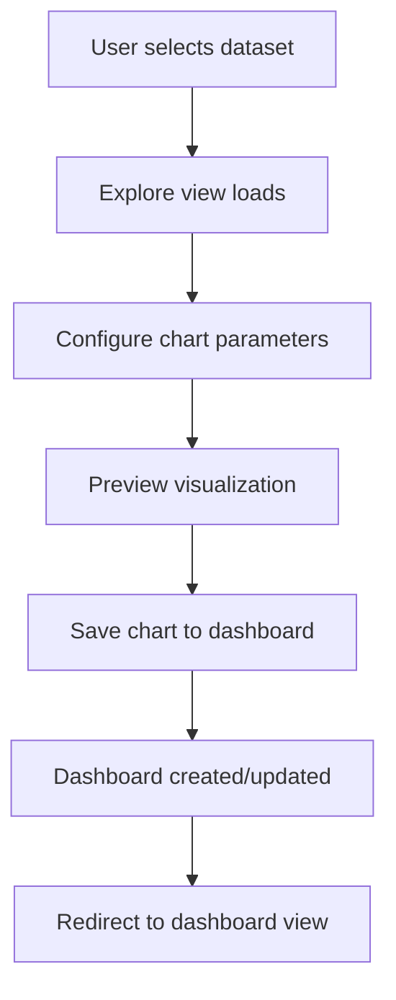
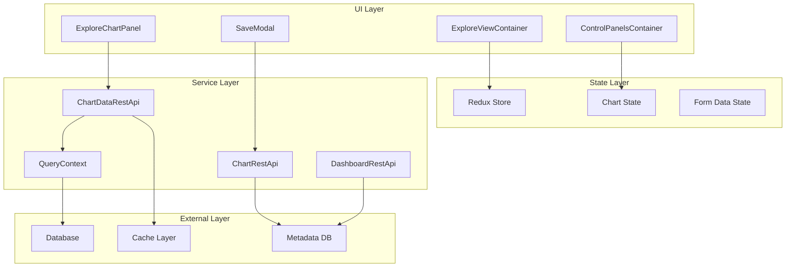
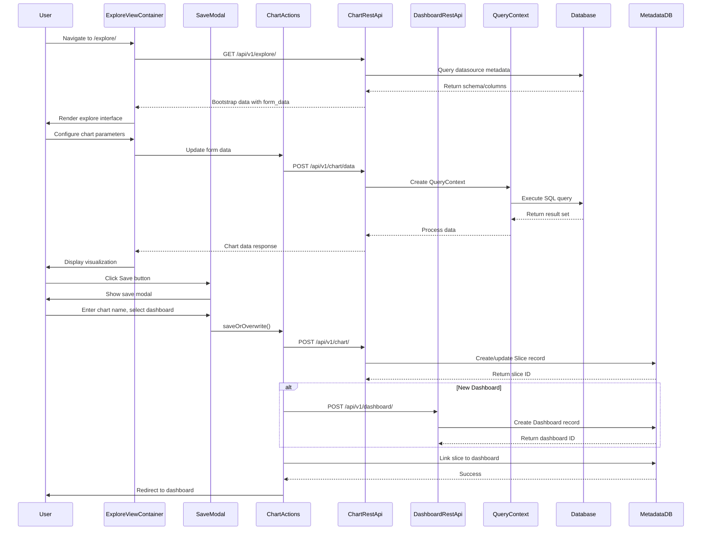

# Explore to Dashboard Creation Lifecycle

## User Story
As a business analyst, I want to explore data from a dataset, create visualizations, and save them to a dashboard so that I can share insights with stakeholders.

## Layer 1: User Journey Flow



## Layer 2: Component Architecture



### Component Mapping

| Component | Implementation | File:Line |
|-----------|---------------|-----------|
| ExploreViewContainer | ExploreViewContainer | `superset-frontend/src/explore/components/ExploreViewContainer/index.jsx:54` |
| SaveModal | SaveModal | `superset-frontend/src/explore/components/SaveModal.tsx:86` |
| ControlPanelsContainer | ConnectedControlPanelsContainer | `superset-frontend/src/explore/components/ControlPanelsContainer/index.jsx` |
| ExploreChartPanel | ExploreChartPanel | `superset-frontend/src/explore/components/ExploreChartPanel/index.jsx` |
| ChartDataRestApi | ChartDataRestApi | `superset/charts/data/api.py:64` |
| ChartRestApi | ChartRestApi | `superset/charts/api.py:107` |
| DashboardRestApi | DashboardRestApi | `superset/dashboards/api.py:161` |
| QueryContext | QueryContext | `superset/common/query_context.py:41` |
| Explore View | Superset.explore | `superset/views/core.py:397` |
| Dashboard Creation | CreateDashboardCommand | `superset/commands/dashboard/create.py:37` |
| Chart Creation | CreateChartCommand | `superset/commands/chart/create.py:42` |

## Layer 3: Sequence Diagram



### Key Design Patterns

1. **Command Pattern**: `CreateChartCommand`, `CreateDashboardCommand` encapsulate business logic
2. **Repository Pattern**: `DashboardDAO`, `ChartDAO` abstract data access
3. **Observer Pattern**: Redux state management for UI updates

## Data Structures

```typescript
// Chart/Slice data structure
interface Slice {
  id: number;
  slice_name: string;
  datasource_id: number;
  datasource_type: string;
  viz_type: string;
  params: JsonObject;
  query_context: string;
  owners: User[];
  dashboards: Dashboard[];
}

// Dashboard data structure
interface Dashboard {
  id: number;
  dashboard_title: string;
  position_json: string; // Layout configuration
  json_metadata: string; // Chart configurations
  description?: string;
  css?: string;
  slug: string;
  slices: Slice[];
  owners: User[];
  published: boolean;
}

// Form data for chart configuration
interface FormData {
  datasource: string; // "table__123"
  viz_type: string;
  metrics: string[];
  groupby: string[];
  filters: Filter[];
  time_range: string;
  granularity: string;
  // ... many more chart-specific fields
}

// Query context for data fetching
interface QueryContext {
  datasource: BaseDatasource;
  queries: QueryObject[];
  form_data: FormData;
  result_type: ChartDataResultType;
  result_format: ChartDataResultFormat;
  force: boolean;
  cache_values: Record<string, any>;
}
```

## Quick Reference

### Event Triggers
- **Chart Creation**: `saveOrOverwrite()` in SaveModal
- **Dashboard Creation**: `CreateDashboardCommand.run()`
- **Data Fetching**: `ChartDataRestApi.data()` endpoint
- **Navigation**: React Router with `/explore/` and `/dashboard/` routes

### Data Formats
- **Form Data**: JSON object with chart configuration
- **Query Context**: Serialized query parameters
- **Dashboard Layout**: JSON with position and metadata
- **Chart Data**: JSON with columns, data array, and metadata

### Error Handling
- **Datasource Not Found**: 404 response with fallback
- **Permission Denied**: 403 response for unauthorized access
- **Query Errors**: 400 response with validation messages
- **Database Connection**: Timeout and retry logic

### Key Endpoints
- `GET /api/v1/explore/` - Bootstrap explore page
- `POST /api/v1/chart/data` - Fetch chart data
- `POST /api/v1/chart/` - Create/update chart
- `POST /api/v1/dashboard/` - Create dashboard
- `GET /superset/dashboard/{id}/` - View dashboard

## Related Lifecycles

1. **Dataset Registration Lifecycle** - Connecting to data sources
2. **SQL Lab Query Lifecycle** - Advanced SQL querying workflow  
3. **Dashboard Sharing Lifecycle** - Permissions and collaboration
4. **Alert Configuration Lifecycle** - Setting up automated alerts
5. **Dashboard Embedding Lifecycle** - Embedding dashboards in external apps

## Component Overview

### Key Components and Services

| Component | Role | Key Methods |
|-----------|------|-------------|
| **ExploreViewContainer** | Main explore page container | `componentDidMount()`, `render()` |
| **SaveModal** | Chart saving interface | `saveOrOverwrite()`, `loadDashboard()` |
| **ChartDataRestApi** | Data fetching service | `data()`, `data_from_cache()` |
| **QueryContext** | Query execution context | `get_payload()`, `get_data()` |
| **CreateChartCommand** | Chart creation business logic | `run()`, `validate()` |
| **CreateDashboardCommand** | Dashboard creation business logic | `run()`, `validate()` |
| **DashboardDAO** | Dashboard data access | `create()`, `update()`, `find_by_ids()` |
| **Superset.explore** | Explore view controller | `explore()`, `save_or_overwrite_slice()` |

### State Management
- **Redux Store**: Global application state
- **Chart State**: Current chart configuration and data
- **Form Data**: Chart parameters and filters
- **Dashboard State**: Dashboard layout and metadata
- **User State**: Permissions and preferences

### Data Flow
1. **Initialization**: Bootstrap data from backend
2. **Configuration**: User modifies form data
3. **Query Execution**: QueryContext processes requests
4. **Data Processing**: Backend processes and returns data
5. **Visualization**: Frontend renders chart
6. **Persistence**: Save chart and dashboard to database
7. **Navigation**: Redirect to dashboard view
