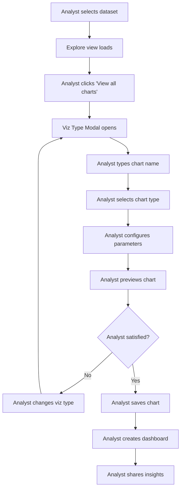
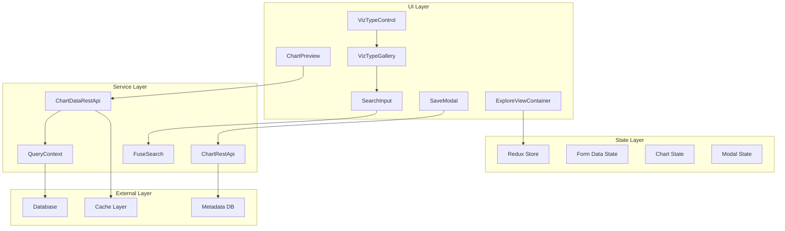
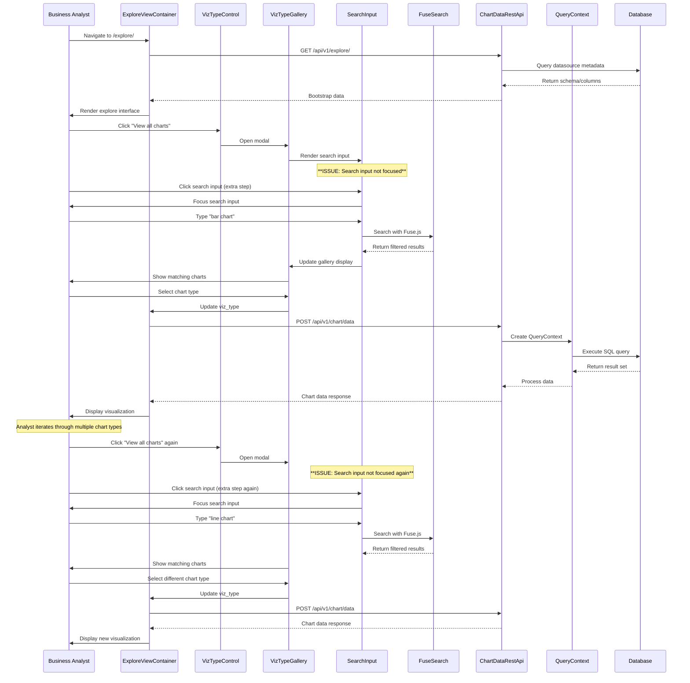

# Business Analyst - Rapid Chart Creation Lifecycle

## User Story
As a business analyst, I want to quickly create multiple charts from a dataset to explore different visualizations and find the best way to present my data insights to stakeholders.

## Layer 1: User Journey Flow



## Layer 2: Component Architecture



### Component Mapping

| Component | Implementation | File:Line |
|-----------|---------------|-----------|
| ExploreViewContainer | ExploreViewContainer | `superset-frontend/src/explore/components/ExploreViewContainer/index.jsx:54` |
| VizTypeControl | VizTypeControl | `superset-frontend/src/explore/components/controls/VizTypeControl/index.tsx:73` |
| VizTypeGallery | VizTypeGallery | `superset-frontend/src/explore/components/controls/VizTypeControl/VizTypeGallery.tsx:438` |
| SearchInput | Input with Fuse.js | `superset-frontend/src/explore/components/controls/VizTypeControl/VizTypeGallery.tsx:730` |
| ChartPreview | ExploreChartPanel | `superset-frontend/src/explore/components/ExploreChartPanel/index.jsx` |
| SaveModal | SaveModal | `superset-frontend/src/explore/components/SaveModal.tsx:86` |
| ChartDataRestApi | ChartDataRestApi | `superset/charts/data/api.py:64` |
| QueryContext | QueryContext | `superset/common/query_context.py:41` |
| FuseSearch | Fuse.js integration | `superset-frontend/src/explore/components/controls/VizTypeControl/VizTypeGallery.tsx:526` |

## Layer 3: Sequence Diagram



### Key Design Patterns

1. **Command Pattern**: `CreateChartCommand` encapsulates chart creation logic
2. **Observer Pattern**: Redux state management for UI updates
3. **Factory Pattern**: `QueryContextFactory` creates query contexts
4. **Search Pattern**: Fuse.js for fuzzy search functionality

## Data Structures

```typescript
// Chart configuration data
interface FormData {
  viz_type: string;
  datasource: string;
  metrics: string[];
  groupby: string[];
  filters: Filter[];
  time_range: string;
  // ... many more chart-specific fields
}

// Search functionality
interface SearchState {
  searchInputValue: string;
  isSearchFocused: boolean;
  isActivelySearching: boolean;
}

// Chart metadata for search
interface ChartMetadata {
  name: string;
  category: string;
  tags: string[];
  description: string;
  thumbnail: string;
  behaviors: string[];
}

// Fuse.js search configuration
interface FuseConfig {
  ignoreLocation: boolean;
  threshold: number;
  keys: Array<{
    name: string;
    weight: number;
  }>;
}
```

## Quick Reference

### Event Triggers
- **Modal Opening**: `VizTypeControl.openModal()`
- **Search Input Focus**: `VizTypeGallery.focusSearch()`
- **Search Execution**: `VizTypeGallery.changeSearch()`
- **Chart Selection**: `VizTypeGallery.onChange()`
- **Chart Data Fetch**: `ChartDataRestApi.data()`

### Data Formats
- **Form Data**: JSON object with chart configuration
- **Search Query**: String input from user
- **Search Results**: Array of filtered ChartMetadata objects
- **Chart Data**: JSON with columns, data array, and metadata

### Error Handling
- **Search Input Not Focused**: User must manually click (current issue)
- **No Search Results**: Show "No charts found" message
- **Chart Creation Errors**: Display validation messages
- **Network Errors**: Show error toast notifications

### Key Endpoints
- `GET /api/v1/explore/` - Bootstrap explore page
- `POST /api/v1/chart/data` - Fetch chart data
- `POST /api/v1/chart/` - Create/update chart
- `GET /api/v1/dashboard/` - List dashboards

## Related Lifecycles

1. **Dataset Selection Lifecycle** - Choosing data source
2. **Chart Configuration Lifecycle** - Setting up chart parameters
3. **Dashboard Creation Lifecycle** - Building comprehensive dashboards
4. **Chart Sharing Lifecycle** - Collaborating with stakeholders
5. **Chart Iteration Lifecycle** - Rapid prototyping

## Component Overview

### Key Components and Services

| Component | Role | Key Methods |
|-----------|------|-------------|
| **VizTypeControl** | Modal management | `openModal()`, `onSubmit()`, `onCancel()` |
| **VizTypeGallery** | Chart selection interface | `focusSearch()`, `changeSearch()`, `stopSearching()` |
| **SearchInput** | Search functionality | `onFocus()`, `onChange()`, `onBlur()` |
| **FuseSearch** | Fuzzy search engine | `search()`, `getResults()` |
| **ChartDataRestApi** | Data fetching | `data()`, `data_from_cache()` |
| **QueryContext** | Query execution | `get_payload()`, `get_data()` |

### State Management
- **Modal State**: `showModal`, `modalKey`, `selectedViz`
- **Search State**: `searchInputValue`, `isSearchFocused`, `isActivelySearching`
- **Chart State**: Current chart configuration and data
- **Form Data**: Chart parameters and filters

### Data Flow
1. **Modal Opening**: User clicks "View all charts"
2. **Search Input**: **ISSUE: Input not auto-focused**
3. **Search Execution**: User types and Fuse.js filters results
4. **Chart Selection**: User selects chart type
5. **Data Fetching**: QueryContext processes request
6. **Visualization**: Frontend renders chart
7. **Iteration**: Analyst repeats for different chart types

## Business Impact Analysis

### Current Pain Points
- **Extra Click Required**: Analyst must click search input before typing
- **Workflow Interruption**: Breaks the flow of rapid chart creation
- **Cognitive Load**: Analyst must remember to click search input
- **Efficiency Loss**: ~2-3 seconds per chart type change

### User Experience Issues
- **Inconsistent Behavior**: Modal opens but search not ready
- **Accessibility Barrier**: Screen readers don't get immediate focus
- **Mobile Impact**: Extra tap required on touch devices
- **Power User Frustration**: Violates keyboard navigation expectations

### Expected Behavior
- **Immediate Focus**: Search input should be focused when modal opens
- **Keyboard Ready**: User can start typing immediately
- **Consistent UX**: Follows modern modal interaction patterns
- **Accessibility Compliant**: Screen readers get immediate focus

### Frequency Analysis
- **High Frequency**: Business analysts change chart types 5-10 times per session
- **Daily Impact**: Affects every chart creation workflow
- **Cumulative Time**: 10-30 seconds lost per session
- **User Satisfaction**: Creates frustration and feels unpolished

This lifecycle analysis shows that the search input focus issue significantly impacts the business analyst workflow, which is one of the most common and important use cases in Superset. The fix would improve productivity, user satisfaction, and accessibility compliance.
