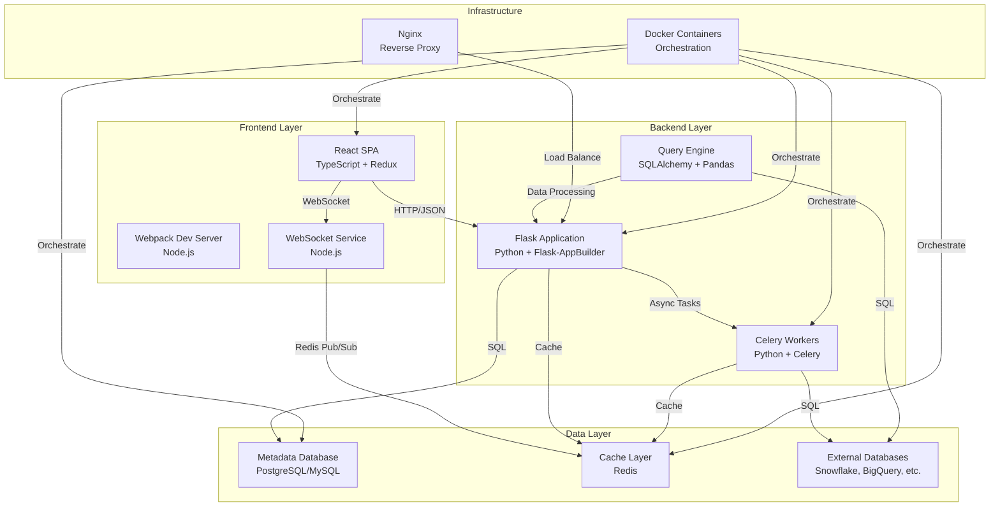

# Apache Superset System Architecture

## System Overview Diagram

## Component Catalog

| Component Name | Technology/Framework | Primary Responsibility | Key Files | Heavy Logic |
|----------------|----------------------|------------------------|-----------|-------------|
| **React SPA** | React + TypeScript + Redux Toolkit | Frontend UI and state management | `superset-frontend/src/views/App.tsx`, `superset-frontend/src/views/store.ts` | Complex dashboard layouts, chart rendering, real-time updates |
| **Flask Application** | Python + Flask + Flask-AppBuilder | REST API, authentication, business logic | `superset/initialization/__init__.py`, `superset/views/core.py` | User management, permissions, data access control |
| **Query Engine** | SQLAlchemy + Pandas + NumPy | SQL query execution and data processing | `superset/common/query_context.py`, `superset/common/query_actions.py` | Query optimization, data transformation, caching |
| **Celery Workers** | Python + Celery + Redis | Background task processing | `superset/tasks/async_queries.py`, `superset/tasks/celery_app.py` | Async queries, report generation, alerts |
| **WebSocket Service** | Node.js + Socket.io | Real-time communication | `superset-websocket/src/` | Live query updates, collaborative editing |
| **Metadata Database** | PostgreSQL/MySQL + SQLAlchemy ORM | Application data persistence | `superset/models/core.py`, `superset/models/slice.py` | User data, charts, dashboards, permissions |
| **Cache Layer** | Redis + Flask-Caching | Query result caching and session storage | `superset/extensions/__init__.py` | Query result caching, session management |
| **Database Connectors** | SQLAlchemy + Custom Engines | External database connectivity | `superset/db_engine_specs/`, `superset/connectors/` | Database-specific query optimization |
| **Security Manager** | Flask-AppBuilder + Custom RBAC | Authentication and authorization | `superset/security/manager.py` | Role-based access control, data source permissions |
| **Command Layer** | Python + Command Pattern | Business logic encapsulation | `superset/commands/` | Chart creation, dashboard management, data operations |

## Technology Stack

### UI Layer
- **React 18** - Component framework
- **TypeScript** - Type safety
- **Redux Toolkit** - State management
- **Ant Design** - UI components
- **D3.js** - Data visualization
- **Webpack** - Module bundling

### State/Logic Layer
- **Redux Store** - Global state management
- **RTK Query** - API state management
- **React Router** - Client-side routing
- **Context API** - Component state sharing

### Service/API Layer
- **Flask** - Web framework
- **Flask-AppBuilder** - Admin interface
- **Marshmallow** - Serialization
- **SQLAlchemy** - ORM
- **Celery** - Task queue
- **Redis** - Message broker

### Data Layer
- **PostgreSQL/MySQL** - Metadata database
- **Redis** - Caching and sessions
- **SQLAlchemy** - Database abstraction
- **Pandas** - Data processing
- **NumPy** - Numerical computing

### External Dependencies
- **External Databases** - Snowflake, BigQuery, Redshift, etc.
- **Mapbox** - Geospatial visualizations
- **OAuth Providers** - Authentication
- **Email Services** - SMTP for alerts
- **Slack API** - Notifications

## Integration Points

### Frontend ↔ Backend
- **Protocol**: HTTP/HTTPS
- **Data Format**: JSON
- **Sync**: Request/Response
- **Authentication**: JWT tokens, session cookies

### Backend ↔ Database
- **Protocol**: SQL over TCP
- **Data Format**: Binary SQL protocol
- **Sync**: Synchronous queries
- **Connection Pooling**: SQLAlchemy engine

### Backend ↔ Cache
- **Protocol**: Redis protocol
- **Data Format**: Serialized objects
- **Sync**: Synchronous operations
- **Persistence**: Optional persistence

### Backend ↔ External Databases
- **Protocol**: Database-specific (JDBC, ODBC, etc.)
- **Data Format**: SQL queries and result sets
- **Sync**: Synchronous queries
- **Connection Management**: Per-database engines

### Workers ↔ Backend
- **Protocol**: Redis message queue
- **Data Format**: Serialized task data
- **Sync**: Asynchronous
- **Task Distribution**: Celery beat scheduler

### WebSocket ↔ Frontend
- **Protocol**: WebSocket over HTTP
- **Data Format**: JSON messages
- **Sync**: Real-time bidirectional
- **Connection Management**: Socket.io

## Where to Start

### To understand user interactions, read:
- **Explore to Dashboard Lifecycle** (`001_lifecycle_explore_to_dashboard.md`)
- **Dashboard Creation Flow** - How users create and manage dashboards
- **SQL Lab Workflow** - Advanced querying capabilities

### To understand data flow, start with:
- **QueryContext** (`superset/common/query_context.py`) - Central query processing
- **ChartDataRestApi** (`superset/charts/data/api.py`) - Data fetching endpoints
- **Database Models** (`superset/models/core.py`) - Data persistence layer

### To understand business logic, start with:
- **Command Layer** (`superset/commands/`) - Business logic encapsulation
- **Security Manager** (`superset/security/manager.py`) - Access control
- **Flask Views** (`superset/views/core.py`) - Request handling

### To understand frontend architecture, start with:
- **App Component** (`superset-frontend/src/views/App.tsx`) - Main application
- **Redux Store** (`superset-frontend/src/views/store.ts`) - State management
- **Route Configuration** (`superset-frontend/src/views/routes.tsx`) - Navigation

## Key Architectural Patterns

### 1. **Layered Architecture**
- Clear separation between UI, business logic, and data layers
- Each layer has specific responsibilities and interfaces

### 2. **Command Pattern**
- Business logic encapsulated in command classes
- Enables transaction management and validation
- Examples: `CreateChartCommand`, `CreateDashboardCommand`

### 3. **Repository Pattern**
- Data access abstracted through DAO classes
- Enables testing and database abstraction
- Examples: `DashboardDAO`, `ChartDAO`

### 4. **Observer Pattern**
- Redux state management for UI updates
- Event-driven architecture for real-time features

### 5. **Factory Pattern**
- Database engine specifications for different databases
- Query context factories for different data sources

## Deployment Architecture

### Development (Docker Compose)
- All services in separate containers
- Volume mounts for live code reloading
- Redis and PostgreSQL for data persistence

### Production
- **Load Balancer**: Nginx or cloud load balancer
- **Application Servers**: Multiple Flask instances
- **Background Workers**: Celery workers on separate machines
- **Database**: Managed PostgreSQL/MySQL
- **Cache**: Managed Redis cluster
- **External Databases**: Cloud data warehouses

## Performance Considerations

### Caching Strategy
- **Query Results**: Cached in Redis with TTL
- **Metadata**: Database connection pooling
- **Static Assets**: CDN for frontend assets

### Scalability
- **Horizontal Scaling**: Multiple Flask workers
- **Database Sharding**: Not implemented (single metadata DB)
- **Async Processing**: Celery for long-running tasks
- **Connection Pooling**: SQLAlchemy engine management

### Security
- **Authentication**: Flask-AppBuilder with multiple providers
- **Authorization**: Role-based access control (RBAC)
- **Data Access**: Row-level security (RLS) support
- **API Security**: CSRF protection, input validation

This architecture supports Superset's core mission of providing a modern, scalable business intelligence platform that can handle diverse data sources and user requirements while maintaining security and performance.
